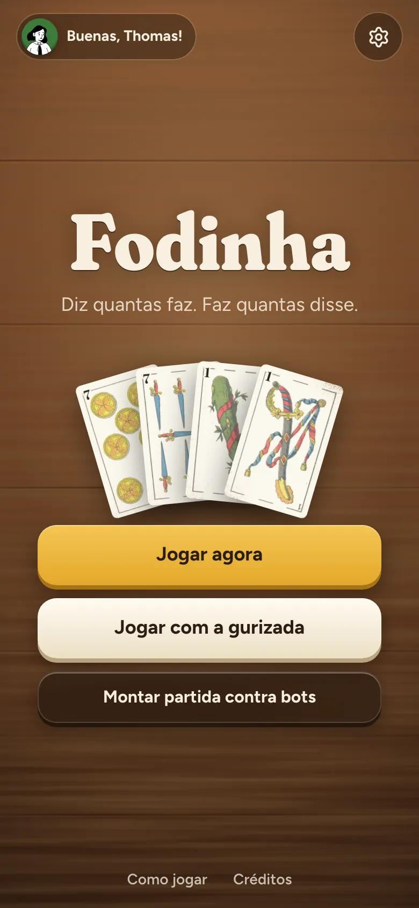
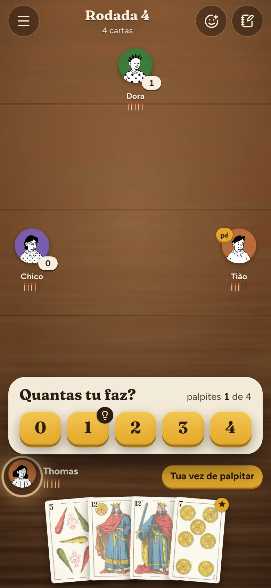
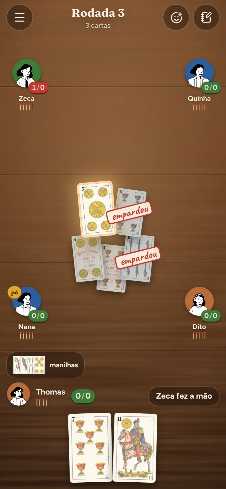

# Faz quantas?

A Fodinha com baralho espanhol e regra gaúcha: diz quantas faz, faz quantas disse. Dá para jogar contra
bots no navegador ou com amigos online. É um webapp pronto para virar app Android e iOS com Capacitor.

<p>
  
  
  
</p>

## Jogar agora

Requisitos: Node 22 ou mais novo e pnpm 9.

```bash
pnpm install
pnpm dev
```

- Abra <http://localhost:5173> e toque em **Jogar agora**: começa uma partida contra 3 bots.
- O `pnpm dev` também sobe o servidor multiplayer na porta 3001. Para jogar online na rede de casa,
  abra `http://<IP-do-computador>:5173` em outro navegador ou no celular (o Vite mostra o endereço
  "Network" no terminal), toque em **Jogar com a gurizada** e crie ou entre numa sala.

## O que tem

- **Regras** da Fodinha pesquisadas e configuráveis. A padrão é a gaúcha com manilhas fixas (espadão,
  bastião, 7 de espadas e 7 de ouros). Detalhes, variantes e fontes em [docs/REGRAS.md](docs/REGRAS.md).
- **Bots** em três níveis. O difícil simula a rodada centenas de vezes (Monte Carlo) e lê os palpites
  na rodada às cegas. Eles só enxergam o que um jogador enxergaria.
- **Online:** salas com código de 4 letras e link de convite. O anfitrião completa a mesa com bots,
  ajusta as regras e o tempo por jogada. Quem cai reconecta no mesmo lugar e, enquanto isso, o jogo
  joga por ele. Tem revanche e volta para a sala.
- **Mesa:** baralho Heraclio Fournier de 1878 (domínio público), mesa de madeira, vidas como palitos
  de fósforo que queimam, caderneta com o placar anotado à mão, reações rápidas, sons e vibração.
- **Continua de onde parou:** a partida local é salva a cada jogada.
- **PWA:** dá para instalar pelo navegador e jogar contra bots offline.
- Funciona no celular em pé e deitado, no tablet e no desktop: a interface cresce com a tela, e as
  cartas na testa (rodada de 1 carta) ficam grandes, na frente de cada jogador. Aceita teclado: 0–9
  palpitam, ←/→ escolhem a carta, Enter joga, Esc abre o menu.

## Estrutura

```
packages/engine/  regras puras (sem dependências), visões por jogador, bots, GameHost e protocolo
apps/server/      servidor Node + socket.io (salas, reconexão, validação) que também serve o web
apps/web/         React + Vite + Tailwind + Motion; projetos Capacitor em android/ e ios/
e2e/              testes de ponta a ponta com Playwright (partida local e online completas)
scripts/          geração de assets (cartas, ícones, avatares) e screenshot para revisão visual
docs/             regras, deploy, apps, spec e plano
```

O mesmo `GameHost` roda no navegador (modo local) e no servidor (modo online). O servidor manda para
cada jogador só a visão dele, então nenhuma carta escondida sai do servidor.

## Comandos

| Comando | O que faz |
|---|---|
| `pnpm dev` | web (5173) + servidor (3001) em modo desenvolvimento |
| `pnpm test` | testes do engine (inclui fuzz de 150 partidas), do servidor, da geometria da mesa e da reconexão online |
| `pnpm e2e` | Playwright: partida local e online inteiras pela interface |
| `pnpm lint` / `pnpm typecheck` | ESLint e TypeScript em todo o monorepo |
| `pnpm build` | build do web (PWA) e do servidor |
| `pnpm start` | produção: <http://localhost:3001> serve o jogo e o multiplayer |
| `FUZZ_GAMES=3000 pnpm --filter @fodinha/engine test` | fuzz longo do engine |
| `node scripts/adversarial-player.mjs` | com o `pnpm dev` no ar: joga partidas pela interface em 6 tamanhos de tela (gira, recarrega, abre folhas no meio) e aponta carta fora da tela, encavalada ou escondida |
| `node scripts/scene-shots.mjs <pasta> 390x844,1436x809 cega,mao` | captura cenas de desenvolvimento em vários tamanhos, para revisão visual |

Cenas de desenvolvimento para revisar o visual: `http://localhost:5173/?cena=empardou` (também `mesa8`,
`palpite`, `mao`, `cega`, `cega8`, `muitas`, `fimrodada`, `fimjogo`, `espectador`, `vira`) e `?galeria` com
o baralho inteiro.

## Produção e apps

- Deploy com Docker, Fly.io, Render ou Cloud Run: [docs/DEPLOY.md](docs/DEPLOY.md).
- Apps Android e iOS com Capacitor: [docs/MOBILE.md](docs/MOBILE.md).

## Créditos

Cartas, sons, avatares e fontes de terceiros estão em [CREDITS.md](CREDITS.md).
